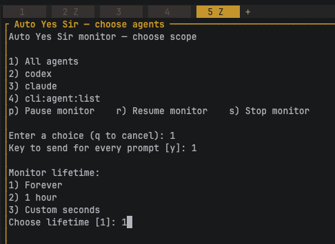

# herdr-Auto-Yes-Sir

##### 身為開發者，我知道……有時候只要回答「是，長官」。

在三秒可取消的倒數後，自動回應 Herdr 代理程式被阻塞時顯示的互動提示。

## 💡更新記錄

* [新增|0818] | 🟢 依次數（預設 10 次）
* [新增|0819] | 🟢 永久／依時間（1 小時／自訂秒數）



監控器使用 Herdr 的 Socket API，而不是輪詢。當代理程式進入 Herdr 中以紅色狀態顯示的 `blocked` 狀態時，監控器會讀取提示文字並送出設定好的單一字元回應。編號選單通常可使用 `1`；核准與是／否提示通常使用 `y`。

> [!WARNING]
> 此插件可能會代替你核准命令與權限。請先檢查原始碼，選擇最小必要的代理程式範圍與執行期限，並在使用期間持續留意。

## 需求

- Herdr 0.8.2 或更新版本
- Node.js 18 或更新版本
- macOS 或 Linux
- 目前不支援 Windows

## 安裝

從 GitHub 安裝已發布的插件：

```bash
herdr plugin install xlinx/herdr-auto-yes-sir
```

若要進行本地開發，請改為連結工作副本：

```bash
git clone https://github.com/xlinx/herdr-auto-yes-sir.git
herdr plugin link "$PWD/herdr-auto-yes-sir"
```

確認插件與兩個公開動作已安裝：

```bash
herdr plugin list
herdr plugin action list --plugin xlinx.herdr-auto-yes-sir
```

## 使用方式

開啟選擇器：

```bash
herdr plugin action invoke xlinx.herdr-auto-yes-sir.enable
```

選擇器可以讓你：

- 監控所有執行中的代理程式，或只監控指定代理程式；
- 選擇單一字元回應鍵（預設為 `y`）；
- 永久執行、執行一小時、執行自訂秒數，或執行指定回應次數；
- 使用 `p` 暫停、`r` 恢復，或使用 `s` 停止。

當代理程式進入 blocked 狀態時，會開啟分割窗格並開始三秒倒數。若要取消該次回應，請輸入 `c` 後按 Enter。若未取消，系統就會將設定好的按鍵送給被阻塞的代理程式。

`Forever` 是預設執行期限。若選擇 `By count` 且次數提示留白，預設為 10 次；每次成功回應後會記錄剩餘次數，降至零時停止。

選擇器底部會顯示持續保存的觸發統計：所有代理程式的總數，以及每個代理程式的成功回應次數。取消的倒數與傳送失敗不會計入統計。

停止監控器：

```bash
herdr plugin action invoke xlinx.herdr-auto-yes-sir.disable
```

停用功能時，若監控器正在暫停，系統會先恢復它，再要求正常關閉並確認程序已結束；若未及時結束，則會強制停止。

## 快捷鍵

Manifest 已註冊：

- `prefix+y` — 開啟監控器選擇器；
- `prefix+shift+y` — 停止監控器。

也可以在 `~/.config/herdr/config.toml` 中手動設定：

```toml
[[keys.command]]
key = "prefix+y"
type = "plugin_action"
command = "xlinx.herdr-auto-yes-sir.enable"
description = "Configure and start Auto Yes Sir"

[[keys.command]]
key = "prefix+shift+y"
type = "plugin_action"
command = "xlinx.herdr-auto-yes-sir.disable"
description = "Stop Auto Yes Sir"
```

## 直接使用監控器

建議使用插件動作；不過，也可以在 Herdr 管理的窗格中直接執行監控器：

```bash
HERDR_ENV=1 node scripts/plugin.js monitor --forever
HERDR_ENV=1 node scripts/plugin.js monitor --duration 900 --agent AGENT_NAME --key y
HERDR_ENV=1 node scripts/plugin.js monitor --count 10 --dry-run
```

可用選項：

- `--forever`
- `--duration SECONDS`
- `--count N`
- `--agent NAME`
- `--key CHARACTER`
- `--dry-run`

若未指定執行期限，直接使用時預設為一小時。

## 記錄與疑難排解

執行期間的活動會附加寫入插件目錄中的 `monitor.log`。記錄包含生命週期動作、Socket API 訂閱、blocked 事件、倒數結果、回應、重新連線與關閉確認。持久化的總計與各代理程式計數器則保存在 Herdr 管理的插件狀態目錄中。執行記錄已被 Git 忽略。

啟動監控器前，設定以下環境變數可取得額外診斷資訊：

```bash
export HERDR_AUTO_YES_SIR_DEBUG=1
```

若更新原始碼後行為沒有變化，請先停止再重新啟用監控器，讓背景 Node.js 程序載入最新程式碼。

## 運作方式

1. `scripts/plugin.js picker` 透過 `control` 子命令，以分離模式啟動 `monitor` 子命令。
2. 監控器透過 `HERDR_SOCKET_PATH` 訂閱 `pane.agent_status_changed`。
3. `agent_status: "blocked"` 事件會觸發最近輸出的讀取。
4. 系統會替提示建立指紋，以避免重複回應。
5. 傳送選定按鍵前，會先開啟可取消的倒數。
6. 新代理程式事件會更新所有代理程式的訂閱；Socket 失敗時會在短暫延遲後重新連線。

詳細函式手冊請參閱 [md/function.md](md/function.md)。

## 開發

執行語法檢查與測試：

```bash
node --check scripts/plugin.js
node --test scripts/test_plugin.test.js
```

## 開發者

### 連結本地原始碼

```text
使用 Herdr 的本地連結流程，不需要推送到 GitHub。

在插件目錄中：

  cd yes_sir_herdr/plugins/herdr-auto-yes-sir

  node --test scripts/test_plugin.test.js
  herdr plugin link "$PWD"
  herdr plugin action list --plugin xlinx.herdr-auto-yes-sir

啟動本地程式碼：

  herdr plugin action invoke xlinx.herdr-auto-yes-sir.enable

測試新的次數功能：

  1. 選取一個代理程式或所有代理程式。
  2. 選取 4) By count。
  3. 按 Enter 使用預設次數 10。
  4. 觸發代理程式的 blocked 提示。
  5. 查看剩餘次數：

  tail -f monitor.log

程式碼變更後停止並重新載入：

  herdr plugin action invoke xlinx.herdr-auto-yes-sir.disable
  herdr plugin action invoke xlinx.herdr-auto-yes-sir.enable

若修改了 herdr-plugin.toml，請重新連結：

  herdr plugin unlink xlinx.herdr-auto-yes-sir
  herdr plugin link "$PWD"

若舊的開發版 ID 仍已註冊，請移除一次：

  herdr plugin unlink local.herdr-auto-yes-sir

再次開啟選擇器後，底部會顯示持久化保存的總觸發次數與各代理程式觸發次數。
```

### 切回 GitHub 版本

```text
若要從本地連結插件切換到 GitHub 管理的版本：

  herdr plugin action invoke xlinx.herdr-auto-yes-sir.disable
  herdr plugin unlink xlinx.herdr-auto-yes-sir

  herdr plugin install xlinx/herdr-auto-yes-sir

  #確認安裝結果：

  herdr plugin list
  herdr plugin action list --plugin xlinx.herdr-auto-yes-sir
  herdr plugin action invoke xlinx.herdr-auto-yes-sir.enable

推送較新程式碼後，若要更新請重新安裝：

  herdr plugin uninstall xlinx.herdr-auto-yes-sir
  herdr plugin install xlinx/herdr-auto-yes-sir

Herdr 會在重新安裝時保留插件設定／狀態目錄，因此已保存的設定與觸發統計應會繼續保留。
```

## Marketplace

此儲存庫已發布並標記 `herdr-plugin` GitHub topic。Herdr 社群 Marketplace 會自動索引預設分支中包含有效 `herdr-plugin.toml` 的公開儲存庫。

## 授權

目前尚未選定授權條款。所有權利均由儲存庫擁有者保留。

<hr/>

## 其他 AI 工具快速連結

* 使用 LLM 與 LLM-Vision 自動產生提示（從模型觸發更多細節）
    * SD-WEB-UI: https://github.com/xlinx/sd-webui-decadetw-auto-prompt-llm
    * ComfyUI: https://github.com/xlinx/ComfyUI-decadetw-auto-prompt-llm
* 自動傳送手機訊息（LINE／Telegram／Discord）
    * SD-WEB-UI: https://github.com/xlinx/sd-webui-decadetw-auto-messaging-realtime
    * ComfyUI: https://github.com/xlinx/ComfyUI-decadetw-auto-messaging-realtime
* 我是 SD-VJ（透過 GPU 即時分享 SD 生成過程）
    * SD-WEB-UI: https://github.com/xlinx/sd-webui-decadetw-spout-syphon-im-vj
    * ComfyUI: https://github.com/xlinx/ComfyUI-decadetw-spout-syphon-im-vj
* CivitAI 資訊／討論：
    * https://civitai.com/articles/6988/extornode-using-llm-trigger-more-detail-that-u-never-thought
    * https://civitai.com/articles/6989/extornode-sd-image-auto-msg-to-u-mobile-realtime
    * https://civitai.com/articles/7090/share-sd-img-to-3rd-software-gpu-share-memory-realtime-spout-or-syphon
